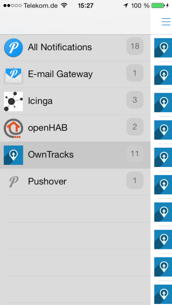

# mqtt2pushover

This program subscribes to any number of MQTT topics (including wildcards) and publishes received payloads to [pushover.net](https://pushover.net).

You associate topic branches to application keys (pushover terminology) in the configuration file (copy `mqtt2pushover.conf.sample` to `mqtt2pushover.conf` for use). 

See details in the config sample for how to configure this script.
The path to the configuration file (which must be valid Python) is obtained from the `MQTT2PUSHOVERCONF` environment variable which defaults to `mqtt2pushover.conf`.

## Obligatory screenshot



## Requirements

* An MQTT broker (e.g. [Mosquitto](http://mosquitto.org))
* A [pushover.net](https://pushover.net/) account
* The Paho Python module: `pip install paho-mqtt`
* `pushover.py` (included) from [https://github.com/pix0r/pushover](https://github.com/pix0r/pushover)

## Installation

```
mkdir /etc/mqtt2pushover/
git clone git://github.com/jpmens/mqtt2pushover.git /usr/local/mqtt2pushover/
cp /usr/local/mqtt2pushover/mqtt2pushover.conf.sample /etc/mqtt2pushover/mqtt2pushover.conf
cp /usr/local/mqtt2pushover/mqtt2pushover.init /etc/init.d/mqtt2pushover
update-rc.d mqtt2pushover defaults
cp /usr/local/mqtt2pushover/mqtt2pushover.default /etc/default/mqtt2pushover
Edit /etc/default/mqtt2pushover and /etc/mqtt2pushover/mqtt2pushover.conf to suit
chmod a+x /usr/local/mqtt2pushover/mqtt2pushover.py
chmod a+x /etc/init.d/mqtt2pushover`
/etc/init.d/mqtt2pushover start`
```
