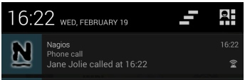
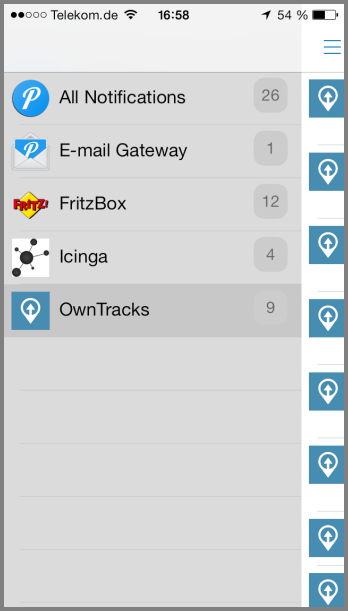
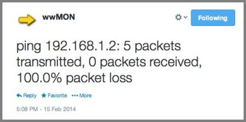

# mqttwarn

To _warn_, _alert_, or _notify_.


This program subscribes to any number of MQTT topics (which may include wildcards) and publishes received payloads to one or more notification services, including support for notifying more than one distinct service for the same message.

For example, you may wish to notify via e-mail and to Pushover of an alarm published as text to the MQTT topic `home/monitoring/+`.

_mqttwarn_ supports a number of services (listed alphabetically below):

* [file](#file)
* [http](#http)
* [log](#log)
* [mqtt](#mqtt)
* [mqttpub](#mqttpub)
* [mysql](#mysql)
* [nma](#nma)
* [nntp](#nntp)
* [nsca](#nsca)
* [osxnotify](#osxnotify)
* [osxsay](#osxsay)
* [pipe](#pipe)
* [prowl](#prowl)
* [pushbullet](#pushbullet)
* [pushover](#pushover)
* [redispub](#redispub)
* [sqlite](#sqlite)
* [smtp](#smtp)
* [twilio](#twilio)
* [twitter](#twitter)
* [xbmc](#xbmc)


Notifications are transmitted to the appropriate service via plugins. We provide plugins for the above list of services, and you can easily add your own.

I've written an introductory post, explaining [what mqttwarn can be used for](http://jpmens.net/2014/04/03/how-do-your-servers-talk-to-you/).


## Getting started

I recommend you start off with the following simple configuration which will log messages received on the MQTT topic `test/+` to a file. Create the following configuration file:

```ini
[defaults]
hostname  = 'localhost'
port      = 1883

; name the service providers you will be using.
launch	 = file, log

[config:file]
append_newline = True
targets = {
    'mylog'     : ['/tmp/mqtt.log']
    }
    
[config:log]
targets = {
    'info'   : [ 'info' ]
  }

[test/+]
targets = file:mylog, log:info
```

**Note**: the closing brace `}` of the `targets` dict must be indented; this is an artifact of ConfigParser.

Launch `mqttwarn.py` and keep an eye on its log file (`mqttwarn.log` by default). Publish two messages to the subscribed topic, using

```
mosquitto_pub -t test/1 -m "Hello"
mosquitto_pub -t test/name -m '{ "name" : "Jane" }'
```

and our output file `/tmp/mqtt.log` should contain the payload of both messages:

```shell
Hello
{ "name" : "Jane" }
```

Both payloads where copied verbatim to the target.

Stop _mqttwarn_, and add the following line to the `[test/+]` section:

```ini
format  = -->{name}<--
```

What we are configuring _mqttwarn_ to do here, is to try and decode the incoming JSON payload and format the output in such a way as that the JSON `name` element is copied to the output (surrounded with a bit of sugar to illustrate the fact that we can output whatever text we want).

If you repeat the publish of the second message, you should see the following in your output file `/tmp/mqtt.log`:

```
-->Jane<--
```

## The `[defaults]` section

Most of the options in the configuration file have sensible defaults, and/or ought to be self-explanatory:

```ini
[defaults]
hostname     = 'localhost'  ; default
port         = 1883
username     = None
password     = None
lwt          = 'clients/mqttwarn'
lwtpayload   = 'offline'
skipretained = True

; logging
logformat = '%(asctime)-15s %(levelname)-5s [%(module)s] %(message)s'
logfile   = 'mqttwarn.log'

; one of: CRITICAL, DEBUG, ERROR, INFO, WARN
loglevel     = DEBUG

; path to file containing self-defined functions for formatmap and datamap
; omit the '.py' extension
functions = 'myfuncs'

; name the service providers you will be using.
launch   = file, log, osxnotify, mysql, smtp

; the directory to which we should cd after startup (default: ".")
; the cd is performed before loading service plugins, so it should
; contain a `services/' directory with the required service plugins.
directory = /tmp/
```

### `functions`

The `functions` option specifies the path to a Python file containing functions you use in formatting or filtering data (see below). Do not specify the `.py` extension to the path name you configure here.

### `launch`

In the `launch` option you specify which _services_ (of those available in the `services/` directory of _mqttwarn_) you want to be able to use in target definitions.


## The `[config:xxx]` sections

Sections called `[config:xxx]` configure settings for a service _xxx_. Each of these sections
has a mandatory option called `targets`, which is a dictionary of target names, each 
pointing to an array of "addresses". Address formats depend on the particular service.

## The `[__topic__]` sections

All sections not called `[defaults]` or `[config:xxx]` are treated as MQTT topics
to subscribe to. _mqttwarn_ handles each message received on this subscription
by handing it off to one or more service targets.

The section name is the topic name (can be overridden using the `topic` option). Consider the following example:

```ini
[icinga/+/+]
targets = log:info, file:f01, mysql:nagios

[my/special]
targets = mysql:m1, log:info
```

MQTT messages received at `icinga/+/+` will be directed to the three specified targets, whereas messages received at `my/special` will be stored in a `mysql` target and will be `log`ged at level "INFO".

Each of these sections has a number of optional (`O`) or mandatory (`M`)
options:

| Option        |  M/O   | Description                                    |
| ------------- | :----: | ---------------------------------------------- |
| `targets`     |   M    | service targets for this SUB                   |
| `topic`       |   O    | topic to subscribe to (overrides section name) |
| `filter`      |   O    | function name to suppress this msg             |
| `datamap`     |   O    | function name parse topic name to dict         |
| `format`      |   O    | function or string format for output           |
| `priority`    |   O    | used by certain targets (see below). May be func()  |
| `title`       |   O    | used by certain targets (see below). May be func()  |
| `image`       |   O    | used by certain targets (see below). May be func()  |
| `template`    |   O    | use Jinja2 template instead of `format`        |     


## Transformation

In addition to passing the payload received via MQTT to a service, _mqttwarn_ allows you do do the following:

* Transform payloads on a per/topic basis. For example, you know you'll be receiving JSON, but you want to warn with a nicely formatted message.
* For certain services, you can change the _title_ (or _subject_) of the outgoing message.
* For certain services, you can change the _priority_ of the outgoing message.

Consider the following JSON payload published to the MQTT broker:

```shell
mosquitto_pub -t 'osx/json' -m '{"fruit":"banana", "price": 63, "tst" : "1391779336"}'
```

Using `format` we can configure _mqttwarn_ to transform that JSON into a different outgoing message which is the text that is actually notified. Part of said `format` looks like this in the configuration file, and basically specifies that messages published to `osx/json` should be transformed as on the right-hand side.

```ini
format = "I'll have a {fruit} if it costs {price}"
```

(Embedded `"\n"` are converted to newlines on output.)

The result is:


You associate MQTT topic branches to applications in the configuration file (copy `mqttwarn.ini.sample` to `mqttwarn.ini` for use). In other words, you can accomplish, say, following mappings:

* PUBs to `owntracks/jane/iphone` should be notified via Pushover to John's phone
* PUBs to `openhab/temperature` should be Tweeted
* PUBs to `home/monitoring/alert/+` should notify Twitter, Mail, and Prowl

See details in the config sample for how to configure this script.
The path to the configuration file (which must be valid Python) is obtained from the `MQTTWARNINI` environment variable which defaults to `mqttwarn.ini` in the current directory.


## Configuration of service plugins

Service plugins are configured in the main `mqttwarn.ini` file. Each service has a mandatory _section_ named `[config:_service_]`, where _service_ is the name of the service. This section _may_ have some settings which are required for a particular service. One mandatory option is called `targets`. This defines individual "service points" for a particular service, e.g. different paths for the `file` service, distinct database tables for `mysql`, etc.

We term the array for each target an "address list" for the particular service. These may be path names (in the case of the `file` service), topic names (for outgoing `mqtt` publishes), hostname/port number combinations for `xbmc`, etc.


### `file`

The `file` service can be used for logging incoming topics, archiving, etc. Each message is written to a path specified in the targets list. Note that files are opened for appending and then closed on each notification.

Supposing we wish to archive all incoming messages to the branch `arch/#` to a file `/data/arch`, we could configure the following:

```ini
[config:file]
append_newline = True
targets = {
    'log-me'    : ['/data/arch']
   }
```

### `http`

The `http` service allows GET and POST requests to an HTTP service.

Each target has four parameters:

1. The HTTP method (one of `get` or `post`)
2. The URL, which is transformed if possible (transformation errors are ignored)
3. `None` or a dict of parameters. Each individual parameter value is transformed.
4. `None` or a list of username/password e.g. `( 'username', 'password')`

```ini
[config:http]
timeout = 60

targets = {
                #method     #URL               # query params or None          # list auth
  'get1'    : [ "get",  "http://example.org?", { 'q': '{name}', 'isod' : '{_dtiso}', 'xx': 'yy' }, ('username', 'password') ],
  'post1    : [ "post", "http://example.net", { 'q': '{name}', 'isod' : '{_dtiso}', 'xx': 'yy' }, None ]
  }
```

Note that transforms in parameters must be quoted strings:

* Wrong: `'q' : {name}`
* Correct: `'q' : '{name}'`

### `log`

The `log` service allows us to use the logging system in use by _mqttwarn_ proper, i.e. messages directed at `log` will land in _mqttwarn_'s log file.

```ini
[config:log]
targets = {
    'info'   : [ 'info' ],
    'warn'   : [ 'warn' ],
    'crit'   : [ 'crit' ],
    'error'  : [ 'error' ]
  }
```

### `mqtt`

The `mqtt` service fires off a publish on a topic, creating a new connection to the configured broker for each message.

Consider the following configuration snippets:

```ini
[config:mqtt]
host =  'localhost'
port =  1883
qos =  0
retain =  False
username =  "jane"
password =  "secret"
targets = {
  'o1'    : [ 'out/food' ],
  'o2'    : [ 'out/fruit/{fruit}' ]
  }

[in/a1]
targets = mqtt:o1, mqtt:o2
format =  u'Since when does a {fruit} cost {price}?'
```

The `topicmap` specifies we should subscribe to `in/a1` and republish to two MQTT targets.
The second target (`mqtt:o2`) has a topic branch with a variable in it which is to be
interpolated (`{fruit}`).

These are the results for appropriate publishes:

```
$ mosquitto_pub -t 'in/a1' -m '{"fruit":"pineapple", "price": 131, "tst" : "1391779336"}'

in/a1 {"fruit":"pineapple", "price": 131, "tst" : "1391779336"}
out/food Since when does a pineapple cost 131?
out/fruit/pineapple Since when does a pineapple cost 131?


$ mosquitto_pub -t 'in/a1' -m 'temperature: 12'

in/a1 temperature: 12
out/food temperature: 12
out/fruit/{fruit} temperature: 12
```

In the first case, the JSON payload was decoded and the _fruit_ variable could be
interpolated into the topic name of the outgoing publish, whereas the latter shows
the outgoing topic branch without interpolated values, because they simply didn't
exist in the original incoming payload.

### `mqttpub`

This service publishes a message to the broker _mqttwarn_ is connected to. (To
publish a message to a _different_ broker, see `mqtt`.)

Each target requires a topic name, the desired _qos_ and a _retain_ flag.

```ini
[config:mqttpub]
targets = {
               # topic            qos     retain
    'mout1'  : [ 'mout/1',         0,     False ]
  }
```

### `mysql`

The MySQL plugin is one of the most complicated to set up. It requires the following configuration:

```ini
[config:mysql]
host  =  'localhost'
port  =  3306
user  =  'jane'
pass  =  'secret'
dbname  =  'test'
targets = {
          # tablename  #fallbackcolumn
 'm2'   : [ 'names',   'full'            ]
  }
```

Suppose we create the following table for the target specified above:

```
CREATE TABLE names (id INTEGER, name VARCHAR(25));
```

and publish this JSON payload:

```
mosquitto_pub -t my/2 -m '{ "name" : "Jane Jolie", "id" : 90, "number" : 17 }'
```

This will result in the two columns `id` and `name` being populated:

```mysql
+------+------------+
| id   | name       |
+------+------------+
|   90 | Jane Jolie |
+------+------------+
```

The target contains a so-called _fallback column_ into which _mqttwarn_ adds
the "rest of" the payload for all columns not targetted with JSON data. I'll now
add our fallback column to the schema:

```mysql
ALTER TABLE names ADD full TEXT;
```

Publishing the same payload again, will insert this row into the table:

```mysql
+------+------------+-----------------------------------------------------+
| id   | name       | full                                                |
+------+------------+-----------------------------------------------------+
|   90 | Jane Jolie | NULL                                                |
|   90 | Jane Jolie | { "name" : "Jane Jolie", "id" : 90, "number" : 17 } |
+------+------------+-----------------------------------------------------+
```

As you can imagine, if we add a `number` column to the table, it too will be
correctly populated with the value `17`.

The payload of messages which do not contain valid JSON will be coped verbatim
to the _fallback_ column:

```mysql
+------+------+-------------+--------+
| id   | name | full        | number |
+------+------+-------------+--------+
| NULL | NULL | I love MQTT |   NULL |
+------+------+-------------+--------+
```

You can add columns with the names of the built-in transformation types (e.g. `_dthhmmss`, see below)
to have those values stored automatically.

### `nma`

```ini
[config:nma]
targets = {
                 # api key                                            app         event
  'myapp'    : [ 'xxxxxxxxxxxxxxxxxxxxxxxxxxxxxxxxxxxxxxxxxxxxxxxx', "Nagios",  "Phone call" ]
  }
```

| Topic option  |  M/O   | Description                            |
| ------------- | :----: | -------------------------------------- |
| `priority`    |   O    | priority. (dflt: 0)                    |



Requires:

* A [Notify My Android(NMA)](http://www.notifymyandroid.com) account
* [pynma](https://github.com/uskr/pynma). You don't have to install this -- just copy `pynma.py` to the _mqttwarn_ directory.

### `nntp`

The `nntp` target is used to post articles to an NNTP news server on a particular newsgroup.

```ini
[config:nntp]
server  = t1.prox
port    = 119
; username = "jane@example.com"
; password = "secret"
targets = {
    #              from_hdr                       newsgroup
    'aa'     : [ 'Me and I <jj@example.com>',    'jp.aa' ],
  }
```

Each target's configuration includes the value given to the `From:` header as well as
a single newsgroup to which the article is posted.

| Topic option  |  M/O   | Description                            |
| ------------- | :----: | -------------------------------------- |
| `title`       |   O    | The post's subject (dflt: `mqttwarn`)  |

Example:

```
mosquitto_pub -t nn/ohoh -m '{"name":"Jane Jolie","number":47, "id":91}'
```

turns into

```
Path: t1.prox!t1.prox!not-for-mail
Content-Type: text/plain; charset="us-ascii"
MIME-Version: 1.0
Content-Transfer-Encoding: 7bit
From: Me and I <jj@example.com>
Subject: Hi there Jane Jolie
Newsgroups: jp.aa
Date: Wed, 26 Mar 2014 22:41:25 -0000
User-Agent: mqttwarn
Lines: 1
Message-ID: <5332caf6$0$20197$41d98655@t1.prox>

Jane Jolie: 47 => 13:41

```

### `nsca`

The `nsca` target is used to submit passive Nagios/Icinga checks to an NSCA daemon.

Consider the following Icinga service description which configures a passive service:

```
define service{
        use                    generic-service
        host_name              localhost
        service_description    Current temp via MQTT
        active_checks_enabled  0
        passive_checks_enabled 1
        check_freshness         0
        check_command          check_dummy!1
        }
```

with the following target definition in `mqttwarn.py`

```ini
[config:nsca]
nsca_host = '172.16.153.112'
targets = {
   #              Nagios host_name,     Nagios service_description,
   'temp'    :  [ 'localhost',          'Current temp via MQTT' ],
  }

[arduino/temp]
targets = nsca:temp
; OK = 0, WARNING = 1, CRITICAL = 2, UNKNOWN = 3
priority = check_temperature()
format = Current temperature: {temp}C
```

Also, consider the following PUB via MQTT:

```
mosquitto_pub -t arduino/temp -m '{"temp": 20}'
```

Using a transformation function for _priority_ to decide on the status to
be sent to Nagios/Icinga, we obtain the following:


| Topic option  |  M/O   | Description                            |
| ------------- | :----: | -------------------------------------- |
| `priority`    |   O    | Nagios/Icinga status. (dflt: 0)        |

The transformation function I've defined as follows:

```python
def check_temperature(data):
    '''Calculate Nagios/Icinga warning status'''
    OK = 0
    WARNING = 1
    CRITICAL = 2
    UNKNOWN = 3
    if type(data) == dict:
        if 'temp' in data:
            temp = int(data['temp'])
            if temp < 20:
                return OK
            if temp < 25:
                return WARNING
            return CRITICAL

    return UNKNOWN
```

Requires [pynsca](https://github.com/djmitche/pynsca), but you don't have to install that; it suffices if you drop `pynsca.py` alongside `mqttwarn.py` (i.e. in the same directory)

### `osxnotify`

* Requires Mac ;-) and [pync](https://github.com/setem/pync) which uses the binary [terminal-notifier](https://github.com/alloy/terminal-notifier) created by Eloy Durán. Note: upon first launch, `pync` will download and extract `https://github.com/downloads/alloy/terminal-notifier/terminal-notifier_1.4.2.zip` into a directory `vendor/`.

| Topic option  |  M/O   | Description                            |
| ------------- | :----: | -------------------------------------- |
| `title`       |   O    | application title (dflt: topic name)   |

### `osxsay`

The `osxsay` target alerts you on your Mac (warning: requires a Mac :-) with a spoken voice.
It pipes the message (which is hopefully text only) to the _say(1)_ utility. You can configure
any number of different targets, each with a different voice (See `say -v ?` for a list of allowed
voice names.)

```ini
[config:osxsay]
targets = {
                 # voice (see say(1) or `say -v ?`)
    'victoria' : [ 'Victoria' ],
    'alex'     : [ 'Alex' ],
  }
```

```ini
[say/warn]
targets = osxsay:victoria
```


```ini
[say/alert]
targets = osxsay:alex
```

* Note: this requires your speakers be enabled and can be a pain for co-workers or family members, and we can't show you a screen shot...

### `pipe`

The `pipe` target launches the specified program and its arguments and pipes the
(possibly formatted) message to the program's _stdin_. If the message doesn't have
a training newline (`\n`), _mqttwarn_ appends one.

```ini
[config:pipe]
targets = {
             # argv0 .....
   'wc'    : [ 'wc',   '-l' ]
   }
```

Note, that for each message targetted to the `pipe` service, a new process is 
spawned (fork/exec), so it is quite "expensive".


### `prowl`

This service is for [Prowl](http://www.prowlapp.com). Each target requires
an application key and an application name.

```ini
[config:prowl]
targets = {
                    # application key                           # app name
    'pjpm'    :  [ 'xxxxxxxxxxxxxxxxxxxxxxxxxxxxxxxxxxxxxxxx', 'SuperAPP' ]
    }
```

| Topic option  |  M/O   | Description                            |
| ------------- | :----: | -------------------------------------- |
| `title`       |   O    | application title (dflt: `mqttwarn`)   |
| `priority`    |   O    | priority. (dflt: 0)                    |


* Requires [prowlpy](https://github.com/jacobb/prowlpy)

### `pushbullet`

This service is for [PushBullet](https://www.pushbullet.com), an app for Android along with an extension for Chrome, which allows notes, links, pictures, addresses and files to be sent between devices. 

You can get your API key from [here](https://www.pushbullet.com/account) after signing up for a PushBullet account. You will also need the device ID to push the notifications to. To obtain this you need  to follow the instructions at [pyPushBullet](https://github.com/Azelphur/pyPushBullet) and run ``./pushbullet_cmd.py YOUR_API_KEY_HERE getdevices``.

```ini
[config:pushbullet]
targets = {
                   # API KEY                  device ID
    'warnme'   : [ 'xxxxxxxxxxxxxxxxxxxxxxx', 'yyyyyy' ]
    }
```

| Topic option  |  M/O   | Description                            |
| ------------- | :----: | -------------------------------------- |
| `title`       |   O    | application title (dflt: `mqttwarn`)   |


Requires:
* a [Pushbullet](https://www.pushbullet.com) account with API key
* [pyPushBullet](https://github.com/Azelphur/pyPushBullet). You don't have to install this -- simply copy `pushbullet.py` to the _mqttwarn_ directory.

### `pushover`

This service is for [Pushover](https://pushover.net), an app for iOS and Android.
In order to receive pushover notifications you need what is called a _user key_
and one or more _application keys_ which you configure in the targets definition:

```ini
[config:pushover]
targets = {
    'nagios'     : ['userkey1', 'appkey1'],
    'alerts'     : ['userkey2', 'appkey2'],
    'tracking'   : ['userkey1', 'appkey2'],
    'extraphone' : ['userkey2', 'appkey3']
    }
```

This defines four targets (`nagios`, `alerts`, etc.) which are directed to the
configured _user key_ and _app key_ combinations. This in turn enables you to
notify, say, one or more of your devices as well as one for your spouse.

| Topic option  |  M/O   | Description                            |
| ------------- | :----: | -------------------------------------- |
| `title`       |   O    | application title (dflt: pushover dflt) |
| `priority`    |   O    | priority. (dflt: pushover setting)     |



* Requires: a [pushover.net](https://pushover.net/) account

### `redispub`

The `redispub` plugin publishes to a Redis channel.

```ini
[config:redispub]
host  =  'localhost'
port  =  6379
targets = {
    'r1'      : [ 'channel-1' ]
    }
```

* Requires Python [redis-py](https://github.com/andymccurdy/redis-py)

### `sqlite`

The `sqlite` plugin creates the a table in the database file specified in the targets,
and creates a schema with a single column called `payload` of type `TEXT`. _mqttwarn_
commits messages routed to such a target immediately.

```ini
[config:sqlite]
targets = {
                   #path        #tablename
  'demotable' : [ '/tmp/m.db',  'mqttwarn'  ]
  }
```

### `smtp`

The `smtp` service basically implements an MQTT to SMTP gateway which needs
configuration.

```ini
[config:smtp]
server  =  'localhost:25'
sender  =  "MQTTwarn <jpm@localhost>"
username  =  None
password  =  None
starttls  =  False
targets = {
    'localj'     : [ 'jpm@localhost' ],
    'special'    : [ 'ben@gmail', 'suzie@example.net' ]
    }
```

Targets may contain more than one recipient, in which case all specified
recipients get the message.

| Topic option  |  M/O   | Description                            |
| ------------- | :----: | -------------------------------------- |
| `title`       |   O    | e-mail subject. (dflt: `mqttwarn notification`) |

### `twilio`

```ini
[config:twilio]
targets = {
             # Account SID            Auth Token            from              to
   'hola'  : [ 'ACXXXXXXXXXXXXXXXXX', 'YYYYYYYYYYYYYYYYYY', "+15105551234",  "+12125551234" ]
   }
```


Requires:
 * a Twilio account
 * [twilio-python](https://github.com/twilio/twilio-python)

### `twitter`

Notification of one or more [Twitter](http://twitter.com) accounts requires setting
up an application at [apps.twitter.com](https://apps.twitter.com). For each Twitter
account, you need four (4) bits which are named as shown below.

Upon configuring this service's targets, make sure the four (4) elements of the
list are in the order specified!

```ini
[config:twitter]
targets = {
  'janejol'   :  [ 'vvvvvvvvvvvvvvvvvvvvvv',                              # consumer_key
                   'wwwwwwwwwwwwwwwwwwwwwwwwwwwwwwwwwwwwwwwwww',          # consumer_secret
                   'xxxxxxxxxxxxxxxxxxxxxxxxxxxxxxxxxxxxxxxxxxxxxxxxxx',  # access_token_key
                   'zzzzzzzzzzzzzzzzzzzzzzzzzzzzzzzzzzzzzzzzzz'           # access_token_secret
                  ]
   }
```



Requires:

* A Twitter account
* app keys for Twitter, from [apps.twitter.com](https://apps.twitter.com)
* [python-twitter](https://github.com/bear/python-twitter)

### `xbmc`

This service allows for on-screen notification popups on [XBMC](http://xbmc.org/) instances. Each target requires
the address and port of the XBMC instance (<hostname>:<port>), and an optional username and password if authentication is required.

```ini
[config:xbmc]
targets = {
                          # host:port,           [user], [password]
    'living_with_auth' :  [ '192.168.1.40:8080', 'xbmc', 'xbmc' ],
    'bedroom_no_auth'  :  [ '192.168.1.41:8080' ] }
    }
```

| Topic option  |  M/O   | Description                            |
| ------------- | :----: | -------------------------------------- |
| `title`       |   O    | notification title                     |
| `image`       |   O    | notification image url  ([example](https://github.com/jpmens/mqttwarn/issues/53#issuecomment-39691429))|

## Plugins

Creating new plugins is rather easy, and I recommend you take the `file` plugin
and start from that.

Plugins are invoked with two arguments (`srv` and `item`). `srv` is an object
with some helper functions, and `item` a dict which contains information on the message
which is to be handled by the plugin. `item` contains the following elements:

```python
item = {
    'service'       : 'string',       # name of handling service (`twitter`, `file`, ..)
    'target'        : 'string',       # name of target (`o1`, `janejol`) in service
    'addrs'         : <list>,         # list of addresses from SERVICE_targets
    'config'        : dict,           # None or dict from SERVICE_config {}
    'topic'         : 'string',       # incoming topic branch name
    'payload'       : <payload>       # raw message payload
    'message'       : 'string',       # formatted message (if no format string then = payload)
    'data'          : None,           # dict with transformation data
    'title'         : 'mqttwarn',     # possible title from title{}
    'priority'      : 0,              # possible priority from priority{}
}
```

## Advanced features

### Transformation data

_mqttwarn_ can transform an incoming message before passing it to a plugin service.
On each message, _mqttwarn_ attempts to decode the incoming payload from JSON. If
this is possible, a dict with _transformation data_ is made available to the
service plugins as `item.data`.

This transformation data is initially set up with some built-in values, in addition
to those decoded from the incoming JSON payload. The following built-in variables
are defined in `item.data`:

```python
{
  'topic'         : topic name
  'payload'       : topic payload
  '_dtepoch'      : epoch time                  # 1392628581
  '_dtiso']       : ISO date (UTC)              # 2014-02-17T10:38:43.910691Z
  '_dthhmm'       : timestamp HH:MM (local)     # 10:16
  '_dthhmmss'     : timestamp HH:MM:SS (local)  # 10:16:21
}
```

Any of these values can be used in `format` to create custom outgoing
messages.

```ini
format = I'll have a {fruit} if it costs {price} at {_dthhmm}
```


### Using functions to replace incoming payloads

Consider the following configuration snippet in addition to the configuration
of the `mqtt` service shown above:

```python
def lookup_data(data):
    if type(data) == dict and 'fruit' in data:
            return "Ananas"
    return None
```

Then, in the section defining the topic we listen on:

```ini
...
[test/topic]
#format =  Since when does a {fruit} cost {price}?
format =  lookup_data()
```

We've replaced the `formatmap` entry for the topic by a function which you
define within the _functions_ file you configure as `functions` in `mqttwarn.ini` configuration file. These functions
are invoked with decoded JSON `data` passed to them as a _dict_. The string returned
by the function returned string replaces the outgoing `message`:

```
in/a1 {"fruit":"pineapple", "price": 131, "tst" : "1391779336"}
out/food Ananas
out/fruit/pineapple Ananas
```

If a function operating on a message (i.e. within `format =`) returns `None` or an empty string, the target notification is suppressed.

### Incorporating topic names into transformation data

An MQTT topic branch name contains information you may want to use in transformations.
As a rather extreme example, consider the [OwnTracks] program (the
artist formerly known as _MQTTitude_).

When an [OwnTracks] device detects a change of a configured waypoint or geo-fence (a region monitoring a user can set up on the device), it emits a JSON payload which looks like this, on a topic name consisting of `owntracks/_username_/_deviceid_`:

```
owntracks/jane/phone -m '{"_type": "location", "lat": "52.4770352" ..  "desc": "Home", "event": "leave"}'
```

In order to be able to obtain the username (`jane`) and her device name (`phone`) for use
in transformations (see previous section), we would ideally want to parse the MQTT topic name and add that to the item data our plugins obtain. Yes, we can.

An optional `topicdatamap` in our configuration file, defines the name of a function we provide, also in the configuration file, which accomplishes that.

```ini
[owntracks/jane/phone]
datamap = OwnTracksTopicDataMap()
```

This specifies that when a message for the defined topic `owntracks/jane/phone` is processed, our function `OwnTracksTopicDataMap()` should be invoked to parse that. (As usual, topic names may contain MQTT wildcards.)

The function we define to do that is:

```python
def OwnTracksTopicDataMap(topic):
    if type(topic) == str:
        try:
            # owntracks/username/device
            parts = topic.split('/')
            username = parts[1]
            deviceid = parts[2]
        except:
            deviceid = 'unknown'
            username = 'unknown'
        return dict(username=username, device=deviceid)
    return None
```

The returned _dict_ is merged into the transformation data, i.e. it is made available to plugins and to transformation rules (`format`). If we then create the following rule

```ini
format = {username}: {event} => {desc}
```

the above PUBlish will be transformed into

```
jane: leave => Home
```

### Filtering notifications ###

A notification can be filtered (or supressed) using a custom function.

An optional `filter` in our configuration file, defines the name of a function we provide, also in the configuration file, which accomplishes that.

```ini
filter = owntracks_filter()
```

This specifies that when a message for the defined topic `owntracks/jane/phone` is processed, our function `owntracks_filter()` should be invoked to parse that. The filter function should return `True` if the message should be suppressed, or `False` if the message should be processed. (As usual, topic names may contain MQTT wildcards.)

The function we define to do that is:

```python
def owntracks_filter(topic, message):
    return message.find('event') == -1
```

This filter will suppress any messages that do not contain the `event` token.

### Templates ###

Instead of formatting output with the `format` specification as described above,
_mqttwarn_ has provision for rendering the output message from [Jinja2] templates,
probably particularly interesting for the `smtp` or `nntp` and `file` targets.

Consider the following example topic configuration, where we illustrate using
a template instead of `format` (which is commented out).

```ini
[nn/+]
targets = nntp:jpaa
; format = {name}: {number} => {_dthhmm}
template = demo.j2
```

_mqttwarn_ loads Jinja2 templates from the `templates/` directory relative to the
configured `directory`. Assuming we have the following content in the file
`templates/demo.j2`

```jinja2
{#
    this is a comment
    in Jinja2
    See http://jinja.pocoo.org/docs/templates/ for information
    on Jinja2 templates.
#}


-

Name.................: {{ upname }}
Number...............: {{ number }}
Timestamp............: {{ _dthhmm }}
Original payload.....: {{ payload }}
```

could produce the following message, on any target which uses this configuration.

```
------------------------------------------------------------
Name.................: JANE JOLIE
Number...............: 47
Timestamp............: 19:15
Original payload.....: {"name":"Jane Jolie","number":47, "id":91}
```

One of the template variables you may be interested in is called `{{ payload }}`; this
carries the original MQTT message in it. Also, if the payload was JSON, those are
available also (as shown in the above example), together with all the other
transformation data.

If the template cannot be rendered, say, it contains a Jinja2 error or the template
file cannot be found, etc., the original raw message is used in lieu on output.

As mentioned already, we think this is useful for targets which expect a certain
amount of text (`file`, `smtp`, and `nntp` come to mind).

Use of this feature requires [Jinja2], but you don't have to install it if you don't need
templating.

## Examples ##

This section contains some examples of how `mqttwarn` can be used with some more complex configurations.

### Low battery notifications ###

By subscribing to your [OwnTracks] topic and adding the following custom filter you can get `mqttwarn` to send notifications when your phone battery gets below a certain level;

```python
def owntracks_battfilter(topic, message):
    data = dict(json.loads(message).items())
    if data['batt'] is not None:
        return int(data['batt']) > 20
    return True
```

Now simply add your choice of target(s) to the topic's section and a nice format string and you are done;

```ini
[owntracks/#]
targets = pushover, xbmc
filter = owntracks_battfilter()
format = My phone battery is getting low ({batt}%)!
```

### Producing JSON

Assuming we get, from an Arduino, say, a single numerical value in the payload of an MQTT
message, we want to generate JSON with some additional fields. Using a Jinja2 template
for the task, does exactly what we need:

The following target configuration invokes the template:

```ini
[arduino/temp]
targets = log:info, http:graylog2
template = temp2json.json
```

The Jinja2 template looks like this:

```jinja2
{#
    We expect a single numeric temperature value in `payload'
    Return JSON suitable for Graylog2 (requires host and short_message)

    Define a data structure in Jinja2 and return it as a JSON string.
    Note how transformation data (produced within mqttwarn) is used:
    the variables `_dtiso' and `payload' contain a timestamp and our
    payload respectively.
#}

{{ data | jsonify }}
```

and an example JSON string returned by that template is then passed to our configured
targets thusly:

```json
"host": "arduino/temp", "woohooo": 17, "tst": "2014-04-13T09:25:46.247150Z", "temperature": "22", "short_message": "Heat 22"}
```


## Requirements

You'll need at least the following components:

* Python 2.x (tested with 2.6 and 2.7)
* An MQTT broker (e.g. [Mosquitto](http://mosquitto.org))
* The Paho Python module: `pip install paho-mqtt`


## Installation

1. Clone this repository into a fresh directory.
2. Copy `mqttwarn.ini.sample` to `mqttwarn.ini` and edit to your taste
3. Install the prerequisite Python modules for the services you want to use
4. Launch `mqttwarn.py`

I recommend you use [Supervisor](http://jpmens.net/2014/02/13/in-my-toolbox-supervisord/) for running this.

## Press

* [MQTTwarn: Ein Rundum-Sorglos-Notifier](http://jaxenter.de/news/MQTTwarn-Ein-Rundum-Sorglos-Notifier-171312), article in German at JAXenter.

  [OwnTracks]: http://owntracks.org
  [Jinja2]: http://jinja.pocoo.org/docs/templates/
